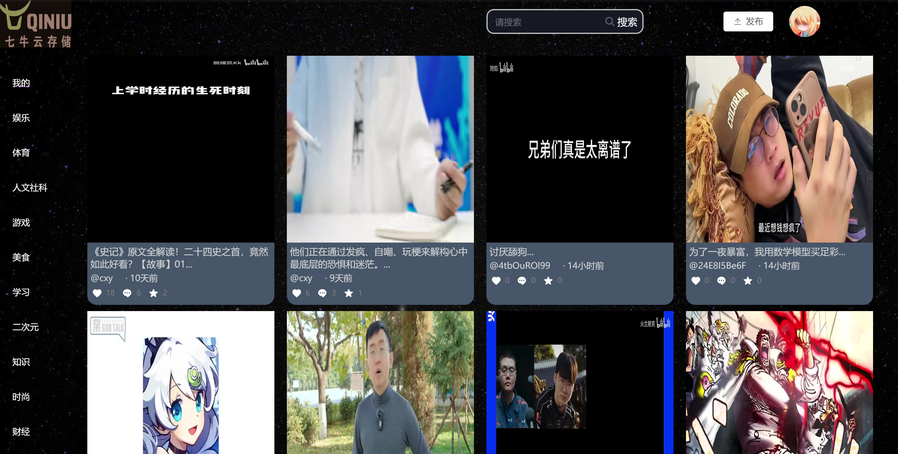

For Chinese README.md,
you can click https://github.com/Joy-aa/videoPlayerFrontEnd/blob/main/README.md

<div align="center">

  <h1>QNY-FrontEnd</h1>

  <p>
    An online video website using Qiniu Cloud storage and video framing technology! 
  </p>

<!-- Badges -->

</div>

<br />

<!-- Table of Contents -->

# :notebook_with_decorative_cover: Table of Contents

- [About the Project](#star2-about-the-project)
    * [Screenshots](#camera-screenshots)
    * [Tech Stack](#space_invader-tech-stack)
    * [Features](#dart-features)
- [Prerequisites](#bangbang-prerequisites)
- [Getting Started](#toolbox-getting-started)
- [Contributing](#wave-contributing)
- [Contact](#handshake-contact)
- [Acknowledgements](#gem-acknowledgements)

<!-- About the Project -->
## :star2: About the Project

<!-- Screenshots -->
### :camera: Screenshots

<div align="center"> 
  
</div>

[//]: # (<!-- Project Structure -->)

[//]: # (### :key: Project Structure)

[//]: # ()
[//]: # (│  ***config files**  )

[//]: # (│  babel.config.js   )

[//]: # (│  jsconfig.json  )

[//]: # (│  package-lock.json  )

[//]: # (│  package.json  )

[//]: # (│  README.md  )

[//]: # (│  tsconfig.json  )

[//]: # (│  vue.config.js  )

[//]: # (│  ***npm library**  )

[//]: # (├─node_modules  )

[//]: # (│  ***public files**  )

[//]: # (├─public  )

[//]: # (│  ***source files**  )

[//]: # (└─src  )

[//]: # (│  ***program entrance file**  )

[//]: # (│     App.vue   )

[//]: # (│     main.ts  )

[//]: # (│     shims-vue.d.ts  )

[//]: # (│  ***login api files**  )

[//]: # (├─api  )

[//]: # (│  ***related images**  )

[//]: # (├─assets  )

[//]: # (├─components  )

[//]: # (│  ***main pages**  )

[//]: # (├─pages  )

[//]: # (│  ├─homepage  )

[//]: # (│  ├─loginIn  )

[//]: # (│  └─user  )

[//]: # (│  ***router files**  )

[//]: # (├─router  )

[//]: # (│      index.ts  )

[//]: # (│  ***storage files**  )

[//]: # (├─store  )

[//]: # (│      index.js  )

[//]: # (│  ***util files**  )

[//]: # (└─utils)

<!-- TechStack -->
### :space_invader: Tech Stack

<ul>
  <li><a href="https://nodejs.org/en">Node.js</a></li>
  <li><a href="https://cn.vuejs.org/">Vue.js</a></li>
  <li><a href="https://www.sass.hk/">SASS</a></li>
  <li><a href="https://element-plus.org/zh-CN/">Element UI</a></li>
  <li><a href="https://vuex.vuejs.org/">VueX</a></li>
</ul>

<!-- Features -->
### :dart: Features

- Account system
    * Login, Logout and Signin.
    * picture verification code.
- Home page
    * Content classification: Video content classification page, such as popular videos and sports channels.
    * Video framing: video cover display.
    * Video info display.
- Search
    * Enter keywords in the search bar to find specific videos, users.
      The search results will display relevant videos and relevant users.
    * Follow/Unfollow related users.
- Upload video
    * Upload your homemade short video.
    * Add a video name, introduction and label.
- Personal information
    * View and edit personal profile information: edit avatar, user name, introduction.
    * View your uploaded videos, favorite videos and view history.
- Video Page
    * Video playback: play, pause, progress bar drag and drop.
    * Video switching: You can scroll through videos using the up and down keys.
    * Volume adjustment, full screen, playback speed adjustment, download.
    * Add watermark.
    * Follow other users.
    * View Like, Comments, Share, Star of videos.
    * Like, Comments, Share, Star the video.
    * Like comments of videos.

<!-- Prerequisites -->
### :bangbang: Prerequisites

Before running this project, you should ensure that you have cloned our backend project locally.
Please refer to https://github.com/Joy-aa/videoPlayerBackEnd/README.md

<!-- Getting Started -->
## 	:toolbox: Getting Started

Before starting, ensure that you have installed Node.js and NPM.
You can find it on the [Node.js official website]( https://nodejs.org/)Download and install them from.

Clone the project

```bash
  git clone https://github.com/Joy-aa/videoPlayerFrontEnd.git
```

Go to the project directory

```bash
  cd videoPlayerFrontEnd
```

Install dependencies

```bash
  npm install
```
```bash
  npm run serve
```

The project will be http://localhost:8080 Run on.
You can access this URL in a browser to view the application.

<!-- Contributing -->
## :wave: Contributing

<a href="https://github.com/Joy-aa/videoPlayerFrontEnd/graphs/contributors">
  
</a>

Contributions are always welcome!

See `README.md` for ways to get started.

<!-- Contact -->
## :handshake: Contact

Yuxin Wang - 22251259@zju.edu.cn

Jia Wang - 22251277@zju.edu.cn

Xinyuan Cheng - 22251133@zju.edu.cn

Project Link: [https://github.com/Joy-aa/videoPlayerFrontEnd](https://github.com/Joy-aa/videoPlayerFrontEnd)

<!-- Acknowledgments -->
## :gem: Acknowledgements

- [Qiniu](https://www.qiniu.com/)
